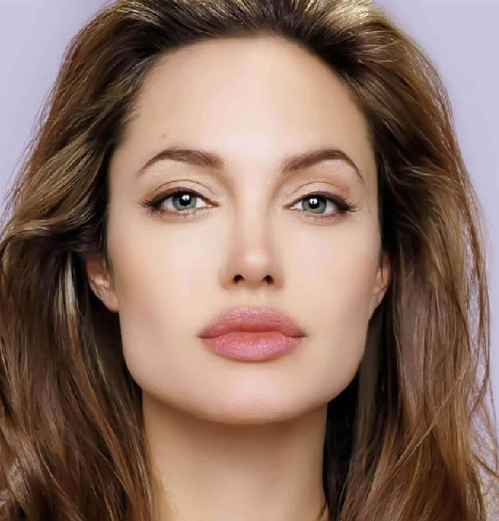
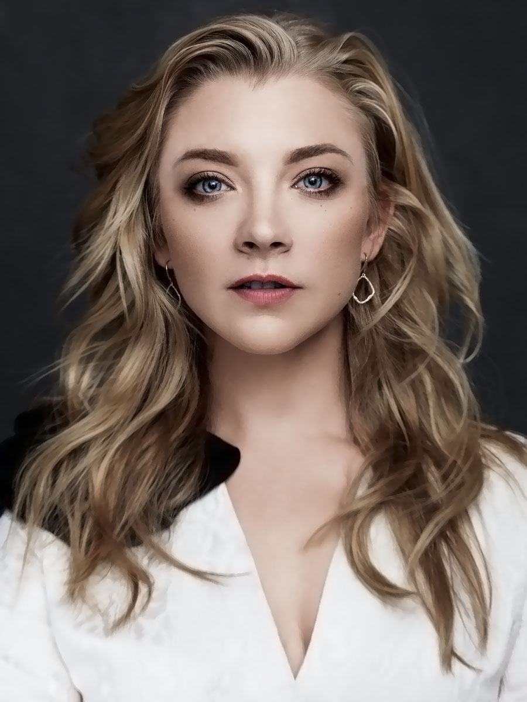
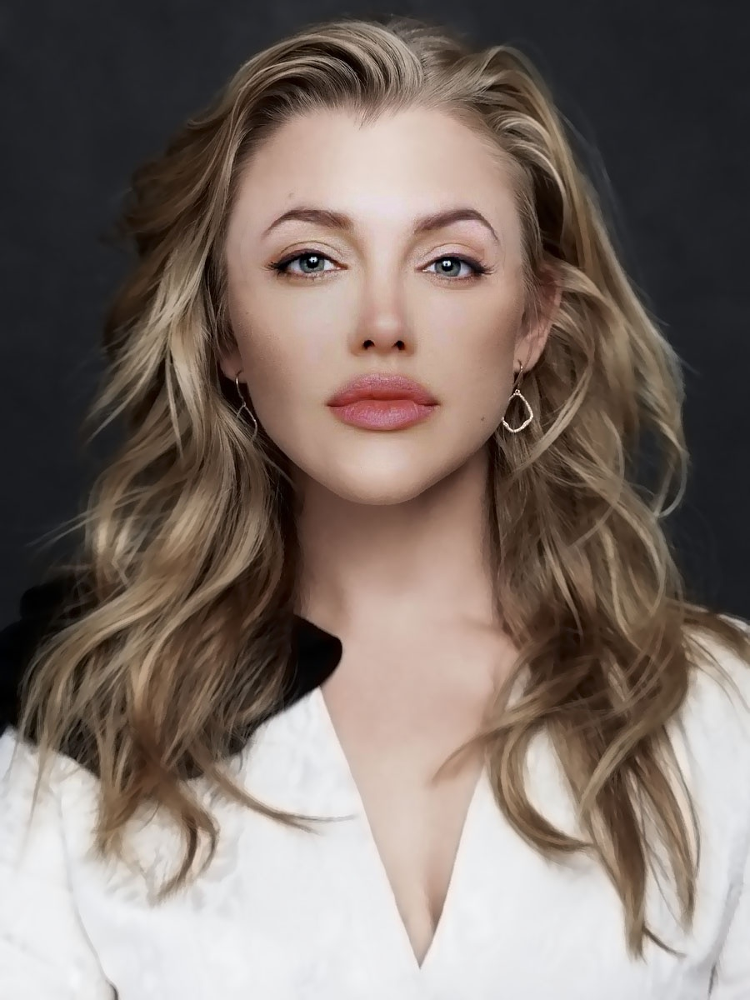

# Gradient-Domain Blending 🎨

## Table of Contents
1. [Introduction](#introduction)
2. [Requirements](#requirements)
3. [Usage](#usage)
4. [Code Overview](#code-overview)
5. [Further Improvements](#further-improvements)
6. [References](#references)

## <a name="introduction"></a>Introduction
Gradient-Domain Blending is an image processing technique that blends two images using the gradients (changes in intensity) of the images instead of their color values. This technique allows for seamless blending between images with complex boundaries and varying color distributions.

This repository contains the code for implementing Gradient-Domain Blending using Python and OpenCV.

<p align="center">
  
   <br>
   this is the image of first woman
<br>
   
<br>
   this is the image of second woman
<br>
   
<br>
this is the blended image as you can see the boundaries are not visible
</p>

## <a name="requirements"></a>Requirements
- Python (3.x)
- OpenCV (4.x or later)
- NumPy (1.19 or later)
- SciPy (1.5 or later)

## <a name="usage"></a>Usage
1. Clone the repository or download the code files.
2. Prepare the source image, target image, and a mask image indicating the regions to blend.
3. Install the required dependencies using `pip`:
   ```
   pip install numpy opencv-python scipy
   ```
4. Adjust the file paths in the code to point to the correct source, target, and mask images.
5. Run the code:
   ```
   python gradient_domain_blending.py
   ```
6. The resulting blended image will be saved as `res07.jpg` in the current directory.

## <a name="code-overview"></a>Code Overview
The code performs the following steps:

1. Import the necessary libraries.
2. Read the source and target images, as well as the mask image.
3. Calculate the Laplacian gradients for each channel of the source image.
4. Process the mask image to separate the foreground and background regions.
5. Prepare the necessary matrices and data structures for solving the linear system.
6. Construct the unknown matrix and linear Laplacian matrix.
7. Solve the linear system to obtain the blending coefficients.
8. Reconstruct the blended image channels.
9. Apply post-processing to ensure pixel values are within the valid range.
10. Create the final blended image by replacing the corresponding region in the target image with the blended result.
11. Save the resulting image to disk.

## <a name="further-improvements"></a>Further Improvements
To enhance the implementation, you can consider the following:

1. Refactor the code into modular functions for better reusability and maintainability.
2. Implement user interaction to allow the selection of source, target, and mask images at runtime.
3. Explore different methods for handling image boundaries to avoid artifacts.
4. Optimize the code for better performance, considering vectorization and parallelization techniques.
5. Experiment with different gradient-based blending techniques to achieve different visual effects.

## <a name="references"></a>References
- Pérez, P., Gangnet, M., & Blake, A. (2003). Poisson image editing. ACM Transactions on Graphics (TOG), 22(3), 313-318.
- Pérez, P., Gangnet, M., & Blake, A. (2003). An evaluation of gradient domain methods for the integration of depth cues. In Proceedings of the 26th annual conference on Computer graphics and interactive techniques (pp. 487-494).
- Paris, S., & Durand, F. (2006). A fast approximation of the bilateral filter using a signal processing approach. In European Conference on Computer Vision (pp. 568-580). Springer, Berlin, Heidelberg.